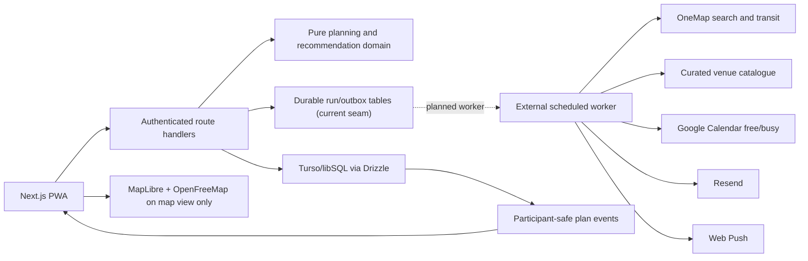
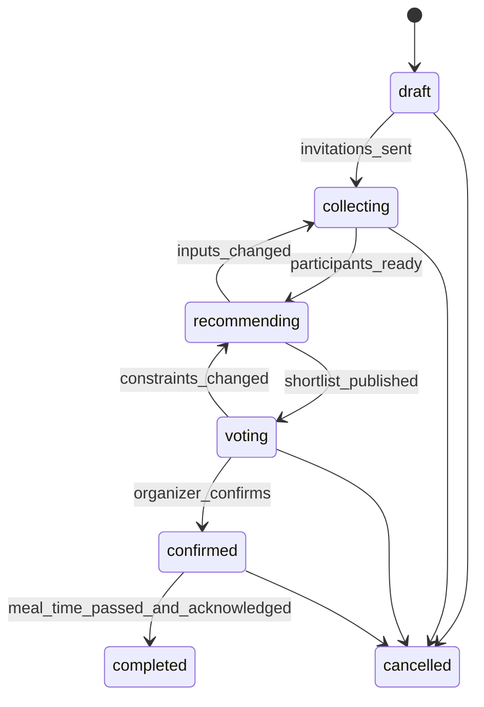

# Hangtime — MVP Architecture and Implementation Blueprint

**Status:** Scope locked; implementation baseline reconciled 2026-08-22
**Market:** Singapore  
**Product:** Couples-first meal planning PWA, supporting two or three participants  
**Primary validation signals:** recommendation satisfaction and a second confirmed plan within 30 days

## 1. Product definition

Hangtime removes the repeated negotiation involved in deciding when and where to meet. An organizer proposes a date, occasion, time window, group budget, and travel-fairness mode. Participants contribute their planning area, availability, dietary restrictions, and cuisine preferences. The food-and-drink MVP produces a small, explainable shortlist of restaurants, cafes, or bars that are practical for the whole group. Participants vote; the organizer confirms the final venue and exact start time. The domain must allow non-F&B activities in a later phase without implying that current venue coverage already supports them.

The experience should feel playful, warm, and socially neutral. It should work especially well for couples without presenting itself as a romance-only product. Its durable visual direction is a **Singapore after-hours shared pass**: a locally grounded planning artifact that carries the same plan identity and route-line progress from setup through confirmation.

### MVP users

- A registered organizer with a persistent profile.
- A saved dining companion, usually a partner or close friend.
- An optional third participant invited by email.
- A guest is represented by a verified, restricted account/session. The guest can later create a full profile and become a saved companion.

### MVP jobs to be done

1. Save reusable food, budget, location, and dietary preferences.
2. Invite one or two people to a meal plan.
3. Collect availability manually or through Google Calendar free/busy access.
4. Find practical Singapore dining areas based on public-transport travel time.
5. Compare a varied shortlist with transparent reasons and cost ranges.
6. Vote without allowing a participant to select every option.
7. Allow the organizer to override the vote with a visible reason.
8. Confirm the exact venue/time and provide directions, booking link, calendar action, and reminders.
9. Collect lightweight post-meal feedback.

### Explicit non-goals

- More than three participants.
- Native iOS or Android apps.
- Live/background location tracking.
- In-app reservations or payments.
- Chat, social feeds, public profiles, or friend discovery.
- Outlook or Apple Calendar integration.
- Sponsored placement or monetization.
- Guaranteed allergy safety or guaranteed menu prices.
- Automated phone/SMS notifications.

## 2. Locked product rules

| Area | MVP rule |
|---|---|
| Platform | Installable, responsive PWA. |
| Authentication | Email one-time code or magic link; no password or phone requirement. |
| Group size | Minimum two and maximum three participants. |
| Connections | Saved dining companions plus expiring email guest invitations. |
| Location | User-selected general home/planning area; exact input is never shown to companions. |
| Calendar | Manual availability for everyone; optional Google Calendar free/busy. |
| Plan input | Proposed date, meal type, time window, group budget, alcohol toggle, cuisine preferences, dietary rules, travel mode. |
| Travel | Public transport by default; organizer chooses `fairest journeys` or `fastest group trip`. |
| Venues | Restaurants, cafes, and bars in Singapore. |
| Shortlist | Dynamic, distinct venue set with multiple possible category badges; no fixed one-venue-per-category structure. |
| Voting | For `n >= 2`, `maxSelections = min(n - 1, floor(n / 2) + 1)`. A single viable venue is confirmed without a ballot. |
| Vote changes | Allowed until the organizer closes voting or confirms a venue. |
| Ties | Display all tied leaders; organizer selects the final venue. |
| Override | UI label is `Choose a different option`, not `veto`. A non-leading choice requires a 10–240 character reason visible to participants. |
| Confirmation | Organizer selects the venue and an exact start time inside the agreed window. Participants acknowledge or flag a conflict. |
| Budget | SGD group total, price tier, alcohol included/excluded, and an estimated range including configurable GST/service charge. |
| Feedback | Two required taps: recommendation satisfaction and willingness to use Hangtime again; optional comment. |

## 3. Council review and course corrections

### Security review

- Hiding locations in the interface is insufficient. Exact planning origins, calendar tokens, invite secrets, push subscriptions, and raw availability must be stored in private tables that are never client-readable or realtime-enabled.
- Invitations require 128-bit-or-stronger random tokens, server-side hashes, intended-email binding, expiry, one-time acceptance, and rate limits.
- All group mutations require server-side membership checks and database-enforced limits. The browser cannot declare organizer status, member count, winner, or vote cap.
- PWA caches, URLs, analytics, logs, emails, and push payloads must never contain coordinates, invite secrets, OAuth tokens, or raw calendar data.
- OneMap and Calendar credentials remain server-only, narrowly scoped, rotated, rate-limited, and absent from browser bundles, map requests, and logs.

### Staff engineering review

- Google and OneMap objects must not leak into the domain model. Use replaceable `Geocoder`, `VenueProvider`, `TravelTimeProvider`, `CalendarProvider`, and `NotificationProvider` interfaces.
- A geographic centroid is not a fair meeting point. Generate candidate zones, then rank actual venues by per-person transit time at the proposed date/time.
- Plans need a versioned state machine and recommendation runs need deterministic, auditable score snapshots.
- Recommendation generation and notifications require a durable queue, idempotency, retries, and dead-letter visibility.
- Provider free tiers are validation budgets, not a permanent business model.

### Product and UX review

- Treat the organizer's veto as a transparent override and require a reason only when selecting a non-leading option.
- Never describe an establishment as allergy-safe. Unknown suitability is not silently treated as compatible.
- A shortlist venue can carry several badges; deduplicate results before display.
- Explain empty results by naming the binding constraint and provide one-at-a-time relaxations.
- Email is the reliable MVP notification channel. Ask for optional web-push permission only after the user has completed a meaningful action.
- Returning users need an action-first dashboard: readiness, ballot, and acknowledgement tasks precede passive or confirmed plans.
- Readiness is deliberate confirmation of location, availability, and dietary state; changing an area must not silently mark every requirement complete.
- Map and shortlist are two views of one ballot. Selection state survives the switch, and the map detail tray may add/remove a candidate without forcing a return to the list.
- Hide other voters' aggregates before a participant's first submission. The aggregate reveal policy must be consistent and tested to reduce anchoring.
- Warn when the organizer confirms before every eligible participant votes, and record incomplete voting in the participant-safe event stream.
- Post-event feedback appears only after the confirmed time in `Asia/Singapore`, except for an explicitly labelled demo preview.

### Singapore after-hours shared-pass identity

The visual system expresses the product's actual differentiator—two or three people converging on a fair, trusted plan—rather than a generic restaurant marketplace.

- **Core artifact:** every active plan is a shared pass with a stable plan label, date/window, people, current action, and state stamp.
- **Journey model:** `Set up → Check in → Shortlist → Vote → Locked` appears as one accessible route-line indicator. Text and state semantics remain available without the decorative line.
- **Visual language:** warm paper, deep ink, chilli red, route green, sun yellow, restrained perforation/stamp details, neighborhood labels, and journey-balance graphics. Avoid official MRT roundels, route maps, or color assignments that imply LTA affiliation.
- **Brand mark:** prefer a rendezvous/connection mark—two points converging into an `H` or bridge—over a generic map pin or plate-and-cutlery symbol.
- **Typography:** one contemporary, highly legible sans plus one characterful display face. Essential labels are never reduced to decorative 8–10px text.
- **Components:** ticket/pass geometry, data rows, stamps, route nodes, and ballot marks form one system. Do not mix an editorial home with generic pastel rounded-card inner screens.
- **Imagery:** use licensed, source-recorded Singapore neighborhood or venue imagery only when it adds decision value. Do not use stock couple avatars as the main brand differentiator.
- **Tone:** concise, warm, and locally literate without forced Singlish. Campaign copy may be playful; controls and errors use plain task language.
- **Scope honesty:** the MVP says `food and drink hangouts`; it does not claim general activities until non-F&B provider coverage exists.
- **Motion:** route/stamp transitions reinforce state changes, respect reduced-motion settings, and never carry required meaning by themselves.

The release-governing behavior, visual, accessibility, privacy, and evidence requirements live in `docs/uat/UAT_PLAN.md`.

## 4. Validated technical stack

The repository contains the implemented modular-monolith MVP. Local development uses an on-disk SQLite database; the supported remote contract uses separate Turso/libSQL databases for Vercel Preview and Production. Iteration 3 is deployed at commit `13e01c559daa1fbe6b11c0d16057f7db54ae18d5` (deployment `dpl_7cDkRk38gbSNUuBQjHR36k5SgP35`) with Production Turso migration 0006 postconditions verified (`m5=1`, `m6=1`, `columns=6`, `indexes=3`, `invite_rows preserved=0`). Preview remains unprovisioned, and authenticated deployed end-to-end, real email delivery, physical-device, and backup/restore evidence remain external gates. This document distinguishes the implemented and deployed baseline from future provider, queue, and calendar work so an aspirational contract is not mistaken for current evidence.

| Layer | Selection | Reason |
|---|---|---|
| Runtime | Node.js 24 LTS (`24.13.x`) | Current local LTS runtime; supported by Next.js. |
| Web framework | Next.js `16.3.1`, App Router | One deployable PWA, server routes, SSR, and clear server/client boundaries. |
| UI runtime | React / React DOM `19.2.8` | Compatible with the selected Next.js release. |
| Language | TypeScript `5.9.3`, strict mode | Mature compiler line; avoid adopting TypeScript 7 on the MVP's first build. |
| Styling | Tailwind CSS `4.3.3` plus accessible Radix-style primitives | Fast responsive UI with explicit accessible component behavior. |
| Validation | Zod `4.4.3` | Shared API, form, queue-message, and environment validation. |
| PWA | Next.js custom service worker (`public/sw.js`) | Manifest, public offline shell, and cache policy. Sensitive routes/API responses remain network-only; Web Push is a future adapter, not current delivery evidence. |
| Database/Auth | Turso/libSQL via `@libsql/client` `0.17.4` + Drizzle ORM `0.45.2`; local SQLite for development | Remote persistence with separate Preview/Production credentials, forward migrations, application-managed magic links/sessions, and server-side authorization. No hosted Postgres, realtime, or client-side row-policy dependency. |
| Jobs | Synchronous recommendation route plus durable status/outbox tables in the current MVP | A durable worker, retries, and dead-letter processing remain planned; Vercel cold starts do not run migrations or background workers. |
| Mapping | MapLibre GL JS `6.4.1` + OpenFreeMap Liberty style | Open-source WebGL renderer with a keyless OpenStreetMap-derived basemap; public service has no SLA, so the list remains usable without it. |
| Venue data | Curated Singapore catalogue for prototype; provider interface later | Validates the planning and voting loop without a paid venue API. Ratings, prices and dietary claims must show provenance/confidence before public beta. |
| SG geocoding | OneMap Search API | Singapore-focused address/postal-code resolution without using paid Google geocoding. |
| SG transit | OneMap Routing API, `routeType=pt` | Public-transport journey estimates and a provider independent of venue discovery. |
| Calendar | Google Calendar API with free/busy-only OAuth scope | Meets the privacy and MVP integration requirement. |
| Email | Resend API with a verified sender domain | Production magic links require real delivery; test outboxes are forbidden in production. |
| Push | Standards-based Web Push with VAPID | No per-message vendor fee; optional and permission-based. |
| Hosting | Vercel Hobby in `sin1` with isolated Turso Free Preview and Production databases | Zero-cost personal tester hosting with remote libSQL persistence; upgrade Vercel before commercial use and reassess hosting/database limits before public beta or horizontal scaling. |
| Unit/integration tests | Vitest `4.1.10` | Pure domain tests, provider contracts, and API behavior. |
| Browser tests | Playwright `1.62.1` | Installability, responsive journeys, accessibility, and full planning flow. |

Pin all versions in the lockfile. Renovate or Dependabot may propose patch upgrades, but deployment requires tests and a human-readable changelog review for Next.js, authentication, and mapping dependencies.

## 5. Mapping and venue cost decision

### Recommendation

Use a free-first, provider-separated stack:

1. **MapLibre GL JS** renders the interactive candidate map. It is loaded only in the map view, receives candidate venue coordinates only, and never receives participant origins.
2. **OpenFreeMap** supplies the keyless Liberty vector-tile style at `https://tiles.openfreemap.org/styles/liberty`. It permits commercial use and requires visible OpenMapTiles/OpenStreetMap attribution, but provides no SLA. A configured self-hosted style can replace it later.
3. **OneMap** is the Singapore-authoritative option for server-side address search and public-transport routing. Search/routing require a registered token; credentials and the three-day token lifecycle stay on the server.
4. **Local fallback data** supplies coarse planning areas, curated venues and clearly labelled low-confidence transit estimates when OneMap credentials or the basemap are unavailable.

MapLibre is a renderer, not a venue, search or routing database. OpenFreeMap supplies basemap tiles, not current opening hours, prices, ratings, dietary safety or booking inventory. The MVP therefore keeps its curated Singapore venue catalogue and must not present it as live data.

### Free-map guardrails

- Keep the style URL and approved tile host centralized and HTTPS-only.
- Preserve MapLibre&apos;s visible OpenFreeMap/OpenMapTiles/OpenStreetMap attribution.
- Load the map only when a user opens map view; voting and confirmation must work if WebGL or the tile service fails.
- Never service-worker-cache, bulk-download or prefetch cross-origin tiles.
- Never put a home coordinate, postal code, private midpoint input or participant label in a style URL, marker, GeoJSON source, log or outbound map link.
- Build OpenStreetMap venue links from public candidate coordinates only.
- Do not use the public Nominatim service for autocomplete or systematic venue discovery; its public-use policy is not appropriate for this product flow.
- Use deterministic intercepted fixtures in pull-request browser tests and one separate scheduled live style-document health check.
- Before public beta, confirm OneMap quota/terms and replace silent Haversine results with explicit provider source and confidence fields.

### Map interaction and acceptance contract

- Candidate order is canonical across shortlist, map markers, keyboard navigation, and the selected-candidate tray. Rank changes require a new frozen recommendation run.
- Ballot state is shared between list and map views. Switching views never clears an unsaved or saved choice; selecting a candidate from the map uses the same formula cap and server contract as the list.
- Markers are native or equivalent buttons with an accessible candidate name, rank, and selected state. The map canvas is never the only way to discover, compare, or choose a venue.
- The selected-candidate tray exposes neighborhood, recommendation reason, travel/budget summary, and the ballot add/remove action without plotting participant origins.
- Participant travel may be summarized with coarse labels and duration/balance graphics outside the basemap. No route line may begin at or reveal a private origin.
- Loading, style-loaded, partial-tile, timeout, WebGL-unavailable, CSP-blocked, and offline states are distinguishable. Every failure lands on an accessible ranked-list fallback with ballot state intact.
- Attribution remains visible at 390px, 1440px, 200% zoom, and installed-PWA viewports; sticky ballot actions must not cover it.
- Reduced motion disables nonessential map easing. Keyboard focus remains visible, and focus returns predictably when leaving map view.
- Pull-request tests intercept style/tile traffic and assert a provider allowlist plus participant-origin canaries. Scheduled health checks prove endpoint availability separately and never replace deterministic acceptance tests.
- Service-worker inspection must prove that style documents, sprites, glyphs, and tiles are absent from Cache Storage.

### Availability and data-quality constraints

- The public OpenFreeMap instance has no SLA. A tile outage shows an accessible list fallback and never blocks planning or voting.
- Curated venue price, rating, opening and dietary data needs a recorded verification date and source; unknown live availability must be labelled unknown.
- Booking URLs are an external handoff, not a claim that a table is available.
- Include the basemap processor and its network behavior in the privacy notice before external testing.

## 6. System architecture



### Architectural boundaries

- `domain/` contains deterministic TypeScript and imports no Next.js, database, Google, or OneMap modules.
- `providers/` translates external responses to canonical domain DTOs and owns timeouts, retries, attribution metadata, and error mapping.
- `repositories/` owns database access. Components never call sensitive tables directly.
- Public clients call authenticated Next.js route handlers only; they never connect directly to Turso. Route handlers and repository helpers enforce participant-safe projections and organizer/member authorization.
- Private operations use server-only route handlers. Turso credentials, location keyrings, Resend keys, and future provider tokens never reach Next.js client bundles.
- Every external mutation uses an idempotency key.

## 7. Plan state machine



Every mutation supplies `expectedVersion`. The database increments `plans.version`; stale writes return HTTP `409 PLAN_VERSION_CONFLICT`. Opening voting freezes the recommendation run and selection cap. Editing date, window, origins, budget, or dietary rules invalidates the run and existing ballots.

## 8. Data model

The current schema uses application-generated text IDs (for example `user_*`, `plan_*`, and `run_*`) and ISO-8601 UTC text timestamps. Plans retain `timezone = 'Asia/Singapore'`. Money is integer Singapore cents. User-entered text is plain text with length limits; HTML is rejected. Turso/libSQL is the remote system of record; local SQLite is a development/legacy-conversion mode only.

### Identity and preferences

| Table | Essential fields and rules |
|---|---|
| `profiles` | `id`, normalized `email`, `display_name`, `avatar_path`, `account_kind(full/guest)`, `timezone`, coarse area, notification preferences, timestamps. Email is stored for the application-managed magic-link identity and is never exposed in participant-safe projections unless required by the current actor. |
| `dining_companions` | `owner_user_id`, `companion_user_id`, `status`, `is_favourite`, `created_at`; unique pair; accepted consent required. |
| `private_locations` | Subject (`profile` or `plan_participant`), owner, optional plan, AES-GCM ciphertext/nonce/tag, payload/key versions, timestamps. Coarse labels remain on participant/profile rows; no client SELECT path exists. |
| `dietary_rules` | `user_id`, `rule_code`, `severity(allergy/hard/preference)`, optional note, visibility; unique per rule. |
| `cuisine_preferences` | `user_id`, `cuisine_code`, `weight` from -2 to +2. |
| `calendar_connections` | `user_id`, provider, encrypted refresh token, granted scopes, expiry/status, timestamps; no client SELECT. |

### Planning and voting

| Table | Essential fields and rules |
|---|---|
| `plans` | Organizer, state, version, date, window start/end, meal type, group budget cents, alcohol flag, fairness mode, timezone, shortlist size config, timestamps. |
| `plan_participants` | Accepted plan members only: plan, verified profile/guest user, role, coarse origin label, ready/acknowledgement state, and join timestamp. `(plan_id, user_id)` is unique. Existing legacy members remain valid. A selected companion is never inserted here before accepting. |
| `plan_invites` | The server-only seat-reservation ledger: plan, reservation kind, optional reserved profile ID, HMAC intended-email hash, token hash, expiry, accepted/revoked/superseded timestamps, accepting user, creator, and timestamps. A live reservation is a bound reservation that is unaccepted, unrevoked, unexpired, and belongs to a joinable plan. New reservations are always bound to an intended account/email; preserved pre-0006 unbound legacy rows remain revocable but cannot claim or reissue a seat and do not consume capacity. |
| `availability_windows` | Participant, plan, start/end, source manual/calendar, derived-at timestamp; only windows intersecting the plan are retained. |
| `recommendation_runs` | Plan/version, algorithm version, status, encrypted private input snapshot, provider timestamps, weights, quota usage, failure code, expiry. |
| `recommendation_candidates` | Run, rank, provider/venue ID, category badges, display fields, travel/price/dietary evidence, booking/map links, and explanation. Provider-derived display data is cached with explicit provenance/verification limits. |
| `candidate_scores` | Candidate, hard-filter result/reasons, food score, budget score, fairness score, total-travel score, quality score, diversity adjustment, total score, deterministic tie breaker. |
| `ballots` | Plan, run, participant, submitted/updated timestamp; unique per participant/run. |
| `ballot_selections` | Ballot and candidate; transaction enforces candidate membership and the frozen maximum selection count. |
| `plan_decisions` | Plan, candidate, exact start time, vote snapshot, decision kind(winner/override), override reason, actor, timestamp; immutable. |
| `plan_events` | Participant-safe event stream: invitation accepted, voting opened, confirmed, changed, cancelled, acknowledged. |

### Operations and learning

| Table | Essential fields and rules |
|---|---|
| `notification_outbox` | Current seam: recipient, channel, template, JSON payload, sent timestamp, and created timestamp. A dispatcher, idempotency key, attempt/dead-letter fields, and safe-payload enforcement are required by DT-011 before plan-event delivery is claimed. |
| `push_subscriptions` | Planned only; no current API/table or delivery evidence. If added, endpoint/keys must be encrypted, owner-bound, revocable, and absent from client/log/analytics payloads. |
| `feedback` | Plan, participant, recommendation satisfaction 1–5, reuse intent boolean, optional reason, timestamps. |
| `audit_events` | Actor, plan, action, redacted metadata, timestamp; immutable and never contains raw origins/tokens. |
| `provider_usage` | Provider, SKU/operation, internal billing events, day/month, soft/hard cap state. |
| `analytics_events` | Pseudonymous actor/plan IDs, event name, safe properties; no address, coordinates, diet notes, or calendar details. |

### Retention

- Guest invite token: until accepted/revoked/expired; maximum 72 hours.
- Group capacity is enforced transactionally as `accepted participants + live reservations <= 3`. Expired, revoked, and accepted reservations do not consume a pending seat. Reissue atomically revokes the old reservation and creates its replacement without a transient free or overbooked seat.
- Unaccepted guest planning data: delete 30 days after plan cancellation/expiry.
- Raw/derived calendar free/busy intervals (when the optional connector is enabled): delete after the plan completes plus 24 hours.
- Encrypted origin snapshot: delete 30 days after plan completion; keep only journey durations and coarse areas for analytics.
- Provider-derived venue display cache: expire according to the active provider/catalogue policy and refresh before display.
- Audit/decision records: retain while the account or plan history exists, with private values redacted.
- Account deletion: delete or irreversibly anonymize locations, preferences, tokens, subscriptions, pending invites, and personal analytics identifiers.

## 9. Provider contracts

```ts
interface Geocoder {
  searchSingapore(query: string): Promise<AddressCandidate[]>;
  resolve(id: string): Promise<PlanningOrigin>;
}

interface VenueProvider {
  discover(input: VenueDiscoveryInput): Promise<VenueRef[]>;
  getDisplayDetails(ids: VenueRef[], fieldSet: "shortlist" | "confirmed"): Promise<VenueDetails[]>;
}

interface TravelTimeProvider {
  estimateTransit(input: TransitBatchInput): Promise<JourneyEstimate[]>;
}

interface CalendarProvider {
  getBusyWindows(input: FreeBusyRequest): Promise<BusyWindow[]>;
}

interface NotificationProvider {
  deliver(message: SafeNotification): Promise<DeliveryReceipt>;
}
```

Canonical DTOs use WGS84 coordinates internally but never expose participant origins to clients. Provider errors map to stable codes such as `PROVIDER_RATE_LIMITED`, `TRANSIT_UNAVAILABLE`, `VENUE_DETAILS_STALE`, and `CALENDAR_REAUTH_REQUIRED`.

## 10. Recommendation algorithm v1

### Inputs

- Two or three verified participants with planning origins.
- Proposed date, time window, and final time granularity of 15 minutes.
- Meal type: brunch, coffee, lunch, dinner, drinks, or custom label mapped to supported venue types.
- Group budget in SGD, participant count, alcohol toggle.
- Hard dietary restrictions and weighted cuisine preferences.
- Fairness mode: `equal_journeys` or `lowest_total_time`.

### Pipeline

1. Validate that every participant is ready. If someone is missing, the organizer may wait or explicitly continue with a provisional plan; no absent participant is silently assumed compatible.
2. Decrypt origins only inside the worker. Create coarse calculation points and never log them.
3. Generate a small set of plausible dining-zone seeds around the geographic centroid and Singapore dining/transit clusters.
4. Use OneMap public-transit estimates at the proposed window to remove obviously unfair zones.
5. Query the configured venue provider around the best zones for restaurant/cafe/bar candidates. The prototype uses a curated catalogue; cap the pre-filter pool at 24 and deduplicate by provider venue ID.
6. Apply hard filters: venue type, business status, operating-window evidence, and known dietary incompatibilities.
7. Fetch expensive details only for the best 12–16 remaining candidates.
8. Obtain OneMap transit durations from each participant to each candidate with bounded concurrency, timeout, retry, and per-run call cap.
9. Calculate budget range and score components.
10. Apply diversity selection so the shortlist is not dominated by one cuisine, chain, or micro-area.
11. Return a configurable shortlist, normally 4–8 venues depending on viable supply, each with one or more badges and a plain-language explanation.
12. Store algorithm version, weights, scores, exclusion reasons, timestamps, and provider identifiers so the run is explainable.

### Hard dietary behavior

No general venue source provides dependable allergy safety, and vegetarian/halal metadata may be incomplete. Each venue attribute must have `value`, `source`, `confidence`, and `checkedAt`.

- Known incompatibility: exclude.
- Verified compatibility from an approved source: include.
- Unknown for an allergy/hard rule: do not silently include. Show an empty/limited-result explanation and offer an explicit `show unverified venues` choice requiring the affected participant's consent.
- Every displayed suitability statement says `reported suitable — confirm directly with the venue` and links to the venue.
- Investigate an official MUIS-approved integration before representing a venue as halal-certified. Search results alone are not certification evidence.

### Scores

All component scores are normalized to `[0, 1]`.

```text
fairness = 1 - clamp((maxJourney - minJourney) / fairnessTolerance)
totalTravel = 1 - clamp(sumJourney / totalTravelTolerance)
foodMatch = weighted agreement across participant cuisine preferences
budgetFit = probability estimated group spend fits the stated budget
quality = Bayesian-adjusted provider quality signal when requested
baseScore = 0.30*fairness + 0.20*totalTravel + 0.25*foodMatch
          + 0.20*budgetFit + 0.05*quality
```

For `lowest_total_time`, swap the fairness and total-travel weights. Weights are stored with every run and can later be tuned from feedback without rewriting history.

### Budget estimate

- Maintain versioned Singapore per-person ranges for each catalogue/provider price tier and meal type.
- Multiply by participant count.
- If alcohol is included, add a configurable per-drinker range rather than assuming every participant drinks.
- Current default estimate applies a typical 10% service charge when configured for the venue, then 9% GST to the subtotal including service charge. These are versioned settings, not hard-coded constants.
- Present `Estimated group spend: S$X–S$Y`, confidence, and assumptions. Never label a venue definitively within budget from price tier alone.

### Explanation examples

- `Fairest trip: 24–29 minutes per person by public transport.`
- `Best food match: Japanese is liked by both diners.`
- `Likely within S$100–S$130 for three, including estimated charges; alcohol excluded.`
- `Opening hours last checked today. Verify before booking.`

## 11. API contracts

The release target is for all JSON endpoints to validate with Zod, require CSRF-safe authenticated requests, enforce rate limits, and return `{ data, error, requestId }`. The current handlers already use bounded validation, membership checks, and stable user-safe errors; complete CSRF/origin enforcement, request IDs, and endpoint-wide rate limits remain release work tracked by DT-007/DT-014.

### Core endpoints

| Method and path | Contract | Current status |
|---|---|---|
| `GET /api/v1/me` | Participant-safe profile and setup status. | Implemented |
| `PATCH /api/v1/me/profile` | Display name, coarse planning area, dietary/cuisine preferences, and notification settings; the server stores the mapped precise origin privately. | Implemented |
| `GET /api/v1/geocode?q=...` | Search the supported Singapore planning-area catalogue; only public/coarse labels are returned. | Implemented with local catalogue; authoritative provider planned |
| `POST /api/v1/companions/invites` | Invite a verified email to become a saved companion. | Implemented (lifecycle limits tracked by DT-012) |
| `POST /api/v1/plans` | In one write transaction create the plan, organizer member/location, one email/account-bound pending seat per selected accepted companion, and safe events. Selected companions are not active members before acceptance. | Implemented; local/API/browser coverage recorded in 2026-08-22 UAT results; deployed authenticated journey remains pending |
| `GET /api/v1/plans/:id/invites` | Organizer-only status projection containing invite ID, display label, seat/delivery state, and expiry; never token hash, raw token, full email, or private plan inputs. | Implemented; local/API/browser coverage recorded in 2026-08-22 UAT results; deployed authenticated journey remains pending |
| `POST /api/v1/plans/:id/invites` | Reserve a remaining seat for a verified intended email/account. Capacity and duplicate target checks occur in one write transaction. | Implemented; local/API/browser coverage recorded in 2026-08-22 UAT results; automated email delivery deferred |
| `POST /api/v1/plans/:id/invites/:inviteId/reissue` | Atomically revoke/supersede one pending reservation and create a replacement. An explicit manual-share response may return one `inviteUrl` once with `Cache-Control: no-store`; it never returns a separate token field. | Implemented; local/API/browser coverage recorded in 2026-08-22 UAT results; deployed authenticated journey remains pending |
| `DELETE /api/v1/plans/:id/invites/:inviteId` | Organizer-only revocation of a still-pending reservation; accepted/terminal reservations fail with stable `409`. | Implemented; local/API/browser coverage recorded in 2026-08-22 UAT results; deployed authenticated journey remains pending |
| `PUT /api/v1/plans/:id/participation` | Atomically claim one live, intended-account/email-bound reservation, insert exactly one active participant, save private location/availability, and consume the reservation; or update an existing member's deliberate readiness. Material changes invalidate derived state. | Implemented; local/API/browser coverage recorded in 2026-08-22 UAT results; deployed authenticated journey remains pending |
| `POST /api/v1/plans/:id/recommendations` | Validate every participant's readiness evidence and create one versioned run; concurrent retries converge on the committed run. The current MVP completes the deterministic curated run synchronously. | Implemented and covered locally; durable async worker planned |
| `GET /api/v1/plans/:id/recommendations/:runId` | Poll queued/running/ready/failed state. | Planned |
| `POST /api/v1/plans/:id/voting/open` | Organizer freezes current run and opens voting. | Implemented |
| `PUT /api/v1/plans/:id/ballot` | Replace the caller's selections transactionally; server computes/enforces cap. | Implemented |
| `POST /api/v1/plans/:id/confirm` | Organizer selects shortlisted candidate and exact time; override reason required for non-leader. | Implemented; delivery receipt is not yet implemented |
| `POST /api/v1/plans/:id/acknowledgements` | Participant accepts or flags a conflict. | Implemented; notification delivery planned |
| `POST /api/v1/plans/:id/feedback` | Satisfaction, reuse intent, optional reason. | Implemented; temporal/idempotency gates tracked by DT-013 |
| `GET /api/v1/notifications` | Paginated in-app activity feed. | Planned |
| `POST /api/v1/push-subscriptions` | Store an owner-bound Web Push subscription after permission. | Planned |
| `GET /api/v1/oauth/google/start` | PKCE/state-protected Calendar connection start. | Planned; manual availability is current |
| `GET /api/v1/oauth/google/callback` | Server token exchange and scope verification. | Planned |
| `DELETE /api/v1/oauth/google` | Revoke provider grant and delete tokens. | Planned |

### Example: create plan

```json
{
  "mealType": "dinner",
  "date": "2026-09-05",
  "window": { "start": "18:30", "end": "20:30" },
  "timezone": "Asia/Singapore",
  "groupBudgetCents": 12000,
  "alcohol": "excluded",
  "travelMode": "public_transit",
  "fairnessMode": "equal_journeys"
}
```

### Example: submit ballot

```json
{
  "expectedPlanVersion": 7,
  "recommendationRunId": "019...",
  "candidateIds": ["019...", "019...", "019..."]
}
```

The transaction verifies plan state, frozen run, caller membership, unique shortlisted candidates, and `candidateIds.length <= maxSelections`.

## 12. Screen and interaction plan

### Information architecture

1. **Landing/sign-in:** concise value proposition, email sign-in, privacy summary, and honest `food and drink hangouts` scope.
2. **Profile setup:** display name, planning area, cuisines, dietary hard rules/preferences, default budget.
3. **Returning home:** `Needs your action` before passive plans; shared-pass rows expose readiness, ballot, or acknowledgement action. First-time empty state carries the fuller product explanation.
4. **Create plan / Set up:** explicit participants, food/drink occasion, date/window, budget/alcohol, and accessible fairness radio group. No companion is silently committed without a visible selected state.
5. **Plan lobby / Check in:** an organizer-safe `People & seats` roster distinguishes `Invite pending`, `Joined · check-in needed`, and `Ready`; pending seats expose copy/reissue/revoke recovery without implying delivery. Accepted participants get one checklist for location, availability, and dietary review; readiness is deliberate, participant-safe, and invalidated by material changes.
6. **Finding places:** real, announced progress (`checking fair areas`, `finding suitable venues`, `estimating journeys`) with idempotent retry/cancel rather than decorative timed progress alone.
7. **Shortlist:** explainable candidate rows plus optional MapLibre map; journey imbalance, group budget, suitability evidence/confidence, provenance, booking, and OpenStreetMap actions.
8. **Voting:** one ballot across list/map, selected count versus formula cap, aggregates hidden before first submission, explicit saved/unsaved state, tie and completion state.
9. **Organizer lock-in:** all leaders, ballots received, incomplete-voting warning, in-window exact time, and transparent `Choose a different option` reason.
10. **Confirmation / Locked pass:** venue, exact time, participant acknowledgements, decision note, directions, booking deep link, and `.ics` add-to-calendar.
11. **Feedback:** two-tap survey only after the confirmed event time, followed by a same-group repeat-plan action.
12. **Settings:** location, preferences, Calendar connection, notification permissions, data export/delete.

### Essential states

- No viable venue: show the binding constraint and independently adjustable budget, cuisine, journey tolerance, time window, or unverified-dietary option.
- Provider failure: keep all plan inputs and expose retry; never return a blank page.
- Calendar failure: explain reauthorization and retain manual availability.
- Venue closed/fully booked after confirmation: `Replace venue` reruns the same constraints excluding the failed place.
- Push denied: the in-app plan remains the source of truth; email is only a fallback after the Resend path is provisioned and a delivery receipt exists.
- Invitation email bounced: until DT-011 is implemented, the organizer sees the in-app invite state rather than a false delivery claim; the release target adds bounded resend/status after rate limiting.
- Invitation terminal states: wrong account, expired, revoked, reused, closed plan, and a lost capacity race use safe, non-enumerating copy with a sign-in/home recovery path. A pending reservation never grants plan access and never appears as an accepted participant.
- Manual link sharing: copying/reissuing is an explicit organizer action. Clipboard failure preserves the same displayed link for retry and must not silently create another reservation. Query-string invite tokens are not accepted.
- Participant changed inputs: warn that current recommendations and ballots will be invalidated.
- Dashboard request failed: distinguish failure from a genuinely empty plan list and expose retry.
- Voting incomplete: tell the organizer exactly how many eligible ballots are missing before an explicit early lock-in.
- Map style/tile/WebGL failure: preserve candidate order and ballot state in the ranked-list fallback.
- Vote response lost after commit: reload the durable ballot and make retry idempotent rather than duplicating a ballot.
- Feedback requested before the event: withhold the survey outside explicitly labelled demo preview mode.

### Accessibility acceptance

- WCAG 2.2 AA contrast and focus visibility.
- Keyboard-complete plan creation and voting.
- 44px minimum touch targets.
- Non-color-only category and state indicators.
- Searchable text alternatives to cuisine imagery.
- Screen-reader labels and live-region updates for recommendation progress and vote limits.
- Reduced-motion support.
- Native or equivalent radio semantics for fairness, venue, time, and ballot selection; no click-only `div` controls.
- Dialog focus trap, Escape handling where safe, and focus restoration to the invoking control.
- Actionable text remains readable at 200% zoom; essential labels are not encoded as decorative microtype.
- Map markers and candidate trays follow canonical rank order and expose selection state without relying on geography.
- At 390px and large text, sticky ballot actions do not obscure candidates, map attribution, or bottom navigation.

## 13. Notifications

### MVP channel priority

1. In-app event feed, always.
2. Transactional email, reliable default.
3. Web push, optional after the first successfully created/joined plan.

### Current implementation boundary

The profile stores email/push preferences and the database has a notification-outbox seam, but the current MVP does not expose an in-app notification feed, plan-event dispatcher, Web Push subscription endpoint, retry/dead-letter worker, or delivery receipt. Resend is currently used only for production magic-link authentication when configured; a test outbox is forbidden in production. The in-app plan state is therefore authoritative, and the confirmation action must not be treated as delivered email/push evidence. DT-011 owns the implementation and staged delivery proof.

### Release target

Notify on invitation, participant-ready reminder, voting opened, confirmation/override, material plan change, acknowledgement conflict, and upcoming-meal reminder. Do not notify on every vote. All messages deep-link to the exact plan state, support preferences/unsubscribe where applicable, and omit private location/diet/calendar details. Each event must be idempotent, have bounded retries/dead-letter visibility, and expose a delivery result without leaking message bodies or private data.

## 14. Security and privacy controls

- Turso tables are never client-readable; server route handlers enforce deny-by-default membership/organizer authorization and participant-safe projections. If the system later adopts a hosted policy layer, equivalent deny-by-default controls remain mandatory.
- Automated authorization matrix for organizer, member, outsider, guest, anonymous, and service role.
- Application-layer AES-GCM encryption for exact origins, OAuth tokens, and push subscriptions with key versioning.
- OAuth authorization-code flow with PKCE, unguessable/replay-protected `state`, exact redirect allowlist, minimal `calendar.freebusy` scope, and server-only token exchange.
- `Secure`, `HttpOnly`, appropriately `SameSite` cookies; CSRF protection for mutations.
- Strict CSP; no user HTML; output encoding in app/email/push.
- Booking and map destinations allowlisted to trusted HTTPS hosts or validated provider URLs.
- Rate limits on auth, invites, invite acceptance/resend, recommendation runs, ballots, confirmation, provider proxies, and push subscription operations.
- No sensitive route/API response in service-worker caches. Use `Cache-Control: no-store` and clear user-scoped caches on logout.
- Coordinates and tokens are automatically redacted from errors, telemetry, structured logs, and analytics.
- Secret scanning, dependency audit, CSP checks, and authorization tests gate deployment.

## 15. Directory tree

The tree below is the target modular organization. The current MVP is intentionally smaller: database schema/init and provider adapters remain under `src/lib`/`src/providers`, and Turso migrations/verifiers are executable scripts under `scripts/`; no hosted-database function directory is required.

```text
hangtime/
├─ .github/workflows/ci.yml
├─ docs/
│  ├─ ARCH_BLUEPRINT.md
│  ├─ API_CONTRACTS.md
│  ├─ PRIVACY_MODEL.md
│  └─ RUNBOOK.md
├─ public/
│  ├─ icons/
│  └─ manifest.webmanifest
├─ src/
│  ├─ app/
│  │  ├─ (auth)/
│  │  ├─ (app)/plans/[planId]/
│  │  ├─ api/v1/
│  │  ├─ error.tsx
│  │  ├─ layout.tsx
│  │  └─ page.tsx
│  ├─ components/
│  │  ├─ ui/
│  │  ├─ plans/
│  │  ├─ recommendations/
│  │  └─ maps/
│  ├─ domain/
│  │  ├─ plans/
│  │  ├─ recommendations/
│  │  ├─ voting/
│  │  ├─ budget/
│  │  └─ notifications/
│  ├─ providers/
│  │  ├─ onemap/
│  │  ├─ open-map/
│  │  ├─ google-calendar/
│  │  ├─ resend/
│  │  └─ web-push/
│  ├─ repositories/
│  ├─ security/
│  ├─ jobs/
│  ├─ analytics/
│  ├─ lib/
│  └─ types/
├─ drizzle/
│  └─ migrations/
├─ tests/
│  ├─ unit/
│  ├─ integration/
│  ├─ contract/
│  ├─ security/
│  └─ e2e/
├─ next.config.ts
├─ package.json
├─ playwright.config.ts
├─ tsconfig.json
└─ vitest.config.ts
```

## 16. Implementation sequence

### Phase 0 — provider spike and product prototype (2–4 days)

- Verify OneMap token renewal, address search, and public-transit routes for representative east/west/north/central Singapore pairs.
- Verify OpenFreeMap style availability, production CSP, attribution, candidate-only outbound coordinates, and the accessible list fallback.
- Test 20 representative venues across restaurant/cafe/bar types and record missing price/dietary/opening-hours data.
- Prototype transit-fair ranking using frozen fixtures for two and three participants.
- Produce low-fidelity mobile flows for shared-pass create → check-in → shortlist/map → vote → lock-in, including action-first home and outage states.

**Exit:** provider terms/cost sheet accepted; no assumption that Maps data can satisfy allergy safety.

### Phase 1 — foundation and security (4–6 days)

- Scaffold pinned Next.js/TypeScript/PWA project.
- Configure local SQLite development, Drizzle schema/migrations, Turso Preview/Production credentials, production magic-link email, and environment-specific location keyrings.
- Implement profiles, private encrypted locations, preferences, companions, guest invites, plan state machine, and audit events.
- Add environment validation, CSP, redaction, rate-limit middleware, error taxonomy, and CI.

**Exit:** auth/invite/location authorization tests pass, including outsider and guest cases.

### Phase 2 — planning workflow (4–6 days)

- Build plan creation, participant lobby, manual availability, readiness, and plan version conflicts.
- Add Google Calendar OAuth/free-busy with manual fallback and disconnect/delete behavior.
- Implement in-app event feed and Resend invitation/reminder templates.

**Exit:** two users and one verified guest can reach `participants_ready` without sharing exact origins.

### Iteration 3 execution graph — pending seat reservations

```text
T0 Frozen reservation/API contract
├─ T1 additive schema + migration + legacy tests
│  └─ T2 transactional reservation helpers
│     ├─ T3 atomic plan creation + invite lifecycle routes
│     └─ T4 atomic acceptance + participant-safe projections
├─ T5 organizer/invitee lobby and join states
└─ T6 unit/API/E2E/accessibility fixtures

T3 + T4 + T5 + T6 -> T7 full gates -> T8 isolated migration -> T9 deployment smoke
```

Iteration 3 definition of done: saved companion selection creates a live reservation but no member; accepted plus live reserved seats never exceed three under concurrency; only the intended signed-in account can accept; revoke/reissue is atomic; organizer projections contain no bearer secret or private profile fields; recommendation generation requires at least two accepted ready participants; legacy active members remain unchanged; migration, unit, API, browser, accessibility, build, PWA, map, security, and production-safe smoke gates pass before promotion. The implementation is deployed at commit `13e01c559daa1fbe6b11c0d16057f7db54ae18d5`, Production Turso 0006 postconditions and one production smoke pass are recorded, while authenticated deployed E2E, Preview provisioning, real email resend, physical-device, and backup/restore evidence remain broader-release gates.

### Phase 3 — recommendation engine (6–9 days)

- Implement provider interfaces, OneMap adapters, the MapLibre/OpenFreeMap candidate map, and explicit local fallback metadata.
- Implement durable queue, worker leases, retries, idempotency, provider quotas, and dead-letter dashboard data.
- Build candidate discovery, hard filters, transit scoring, budget estimates, diversity, explanations, and reproducible snapshots.
- Add one ballot-aware shortlist/map experience, lazy MapLibre loading, marker/tray keyboard behavior, empty/error/stale states, and persistent provider attribution.

**Exit:** frozen fixtures are deterministic and a live Singapore smoke test produces explainable results without exceeding internal API budgets.

### Phase 4 — voting and confirmation (4–5 days)

- Implement transactional ballot replacement and canonical vote cap.
- Add participant-safe aggregates with a defined post-submission reveal policy, tie/completion behavior, incomplete-ballot warning, organizer override reason, immutable decision, exact time selection, and acknowledgement.
- Add allowlisted booking/OpenStreetMap deep links and `.ics` calendar download.

**Exit:** concurrency tests prevent over-voting, fourth participants, stale ballots, and double confirmation.

### Phase 5 — PWA, notifications, feedback, and beta readiness (4–6 days)

- Add install manifest, offline shell, network-only sensitive routes, safe cache clearing, and optional Web Push.
- Add reminder jobs, delivery receipts, feedback flow, and success-event instrumentation.
- Complete responsive/accessibility/browser testing, privacy/terms pages, operational runbook, quotas, alerts, backups/export procedure, and beta seed data.

**Exit:** complete mobile browser flow passes on current Chrome, Safari/iOS installed PWA, and Edge; beta checklist approved.

Estimated focused MVP build: **24–36 engineering days**, depending primarily on OneMap transit behavior, Google venue-field coverage, and calendar OAuth verification.

## 17. Test and release gates

### Required automated suites

- Unit: state transitions, vote formula, scoring, diversity, budget math, redaction, encryption envelope, and notification templates.
- Property/fuzz: vote limits, score ranges, time-window overlap, budget rounding, and malformed provider payloads.
- Integration: every API with server-side authorization; queue/outbox idempotency when the worker is added; OAuth state/PKCE; provider adapters against recorded compliant fixtures.
- Security: outsider/anonymous matrix, invite reuse/enumeration, fourth-member race, over-vote race, XSS, CSRF, SSRF/URL allowlist, quota abuse, service-worker cache audit.
- E2E: action-first home; organizer plus participant plus guest; manual and Calendar availability; deliberate readiness; no-results recovery; list/map ballot parity and outage; unbiased first ballot; tie/incomplete voting; override; confirmation; time-gated feedback; account deletion.
- Accessibility: automated axe checks plus keyboard and screen-reader smoke flows.
- Visual/responsive: criterion-level 390px and 1440px screenshots for home, check-in, shortlist, map/fallback, ballot, and confirmation; 200% zoom and sticky-action collision assertions.
- Map privacy: intercepted outbound allowlist, candidate-only coordinate canaries, visible attribution, no cross-origin tile caching, deterministic failure fallback, and a separately labelled scheduled live provider check.

### Three verification strikes during implementation

For each milestone run, in order:

1. `pnpm lint && pnpm typecheck`
2. `pnpm test`
3. `pnpm build && pnpm test:e2e`

Any failure receives a documented root cause before an edit and counts as a strike for that command. After three failed repair attempts on the same gate, stop and request human input with exact logs and attempted corrections.

### Beta acceptance

- No exact location, OAuth token, invite secret, calendar response, or push endpoint appears in browser payloads, logs, analytics, URLs, emails, participant-safe plan events, or caches.
- At least 20 representative Singapore planning scenarios have human-reviewed travel/budget explanations.
- Recommendation p95 completes within 15 seconds or provides useful staged async progress.
- Provider outage retains plan data and offers a usable retry/fallback.
- Quota exhaustion cannot create billable overage under configured hard limits.
- All confirmed venues show required provider attribution and verification caveats.
- PWA is installable and the primary flow works at 360px width.
- Shared-pass identity and route-line state remain coherent across the complete journey; returning users reach their required action before promotional content.
- Every primary map/list/ballot interaction works at 390px by keyboard with the same durable selection state, and map unavailability never blocks confirmation.

The complete story-level acceptance contract, automation status, fixtures, evidence requirements, edge cases, and release disposition are defined in `docs/uat/UAT_PLAN.md`. Release reporting must trace each result to those stable story IDs.

## 18. Measurement plan

### Product events

- `plan_created`
- `participant_ready`
- `shortlist_generated`
- `vote_submitted`
- `plan_confirmed`
- `participant_acknowledged`
- `booking_link_opened`
- `feedback_submitted`
- `repeat_planner_30d`

### MVP dashboard

- North-star validation: percentage of users who confirm a second plan within 30 days.
- Recommendation satisfaction: percentage rating 4 or 5 out of 5.
- Funnel: created → all participants ready → shortlist → votes → confirmed → acknowledged.
- Median time from plan creation to confirmation.
- No-result and provider-failure rates by binding constraint/provider.
- Average Google SKU events and OneMap calls per generated shortlist.

Avoid declaring `meal_completed` solely because time passed. It is only a proxy unless a participant confirms or submits feedback.

## 19. Deferred roadmap

### After MVP validation

- Outlook Calendar, then an Apple-friendly calendar path.
- Larger groups and richer voting methods.
- Accessibility, ambience, noise, seating, and alcohol preferences.
- Verified dietary-data partnerships and broader certification support.
- Native share targets, WhatsApp sharing, and deeper booking integrations.
- User-submitted venue corrections with moderation and provenance.

### Monetization, only after trust is established

If tested, sponsored venues must be explicitly labelled, must satisfy every hard constraint, and must never alter the organic score or appear as the organic winner. Measure whether sponsorship damages satisfaction or repeat planning before expanding it.

## 20. Current external facts used in this blueprint

- [MapLibre GL JS documentation](https://maplibre.org/maplibre-gl-js/docs/)
- [OpenFreeMap service and attribution](https://openfreemap.org/)
- [OpenFreeMap integration guide](https://openfreemap.org/quick_start/)
- [OneMap routing API](https://www.onemap.gov.sg/apidocs/routing)
- [OneMap authentication](https://www.onemap.gov.sg/apidocs/authentication)
- [Bing Maps retirement notice](https://learn.microsoft.com/en-us/bingmaps/rest-services/getting-started-with-the-bing-maps-rest-services)
- [Google Calendar quota and pricing](https://developers.google.com/workspace/calendar/api/guides/quota)
- [Turso documentation](https://docs.turso.tech/)
- [Turso point-in-time recovery](https://docs.turso.tech/features/point-in-time-recovery)
- [Vercel Functions documentation](https://vercel.com/docs/functions)
- [Resend free limits](https://resend.com/docs/knowledge-base/what-is-resend-pricing)
- [Singapore F&B GST and service-charge calculation](https://www.iras.gov.sg/taxes/goods-services-tax-%28gst%29/specific-business-sectors/hotel-and-food-beverage)
- [Web Push API](https://developer.mozilla.org/en-US/docs/Web/API/Push_API)
